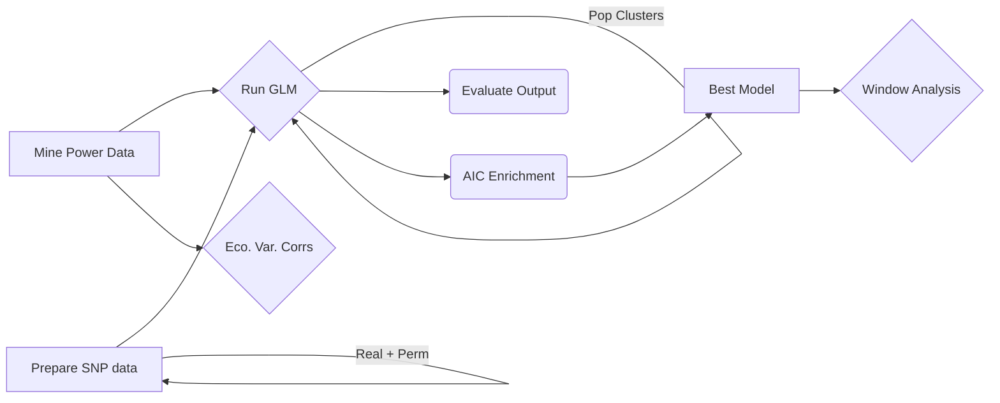

# 6.0.GLM.Model_Search.ENVs

This folder contains the bulk of our GLM analysis. There are several steps to this process. This folder contains the bulk of the seasonal analysis. 

## 1.Run.GLM.AIC_comparisons

* `1.getEnvironmentMatrix.global.R`: Mine the NASA POWER dataset
* `2.0.environmentalOmbinus.global.R`: Run the GLM
* `2.1.environmentalOmbinus.global.sh`: Launcher of 2.0
* `2.3.environmentalOmbinus.global.collect2.sh`: Collect and summarize output of 2.0
* `3.0.environmentalOmbinus.global.bestAIC.R`: Run the AIC enrichment analysis
* `3.1.environmentalOmbinus.global.bestAIC.sh`: Launcher of 3.0
* `3.2.environmentalOmbinus.global.collect2.R`: Collect and summarize output of 3.0
* `3.3.environmentalOmnibus.global.bestAIC.plot.R`: plot data from 3.0
* `4.0.environmentalOmnibus.global.crossClusterEnrichment.R`: Look at cross-cluster enrichment
* `4.1.environmentalOmnibus.global.crossClusterEnrichment.sh` Launcher of 4.0
* `5.0.environmentalOmnibus.global.crossClusterEnrichment.plot.R`: Plot cross-cluster enrichment
* `5.1.environmentalOmnibus.global.crossClusterEnrichment.collect.R`: Collect cross-cluster
* `misc.R`: Misc. stuffs...

### Folders inside  1.Run.GLM.AIC_comparisons

* AIC_delta_analysis: Contains code to study the $\delta AIC$ of the models
* Aux_NoAE: a re-done model that includes NoA-E
* BEST_MODELS: Code to make the best models stable
* Data: Useful, mostly R objects, data needed to run the GLM.

## 2.Evaluate_Omnibus_analysis
Code to estimate general statistics from the GLM models.

## 3.Window_analysis_and_viz
It contains code to determine whether there are windows within the genome, particularity in 2L, that are enriched for GLM snps.

## 5.Ecological_variables.corr
Runs correlation analyses between ecological variables.