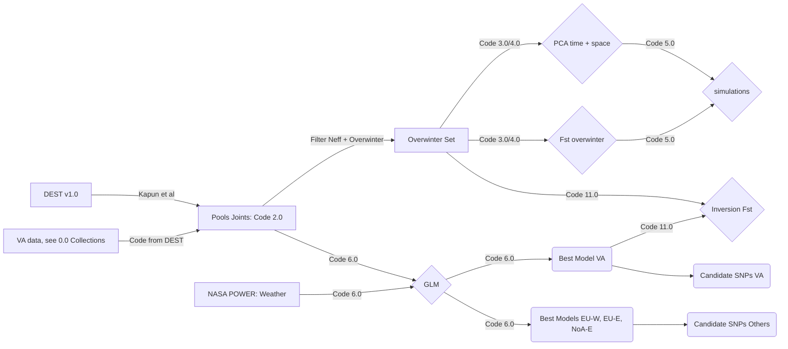
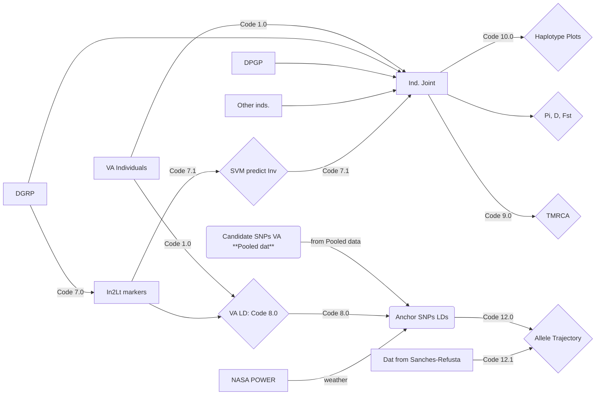
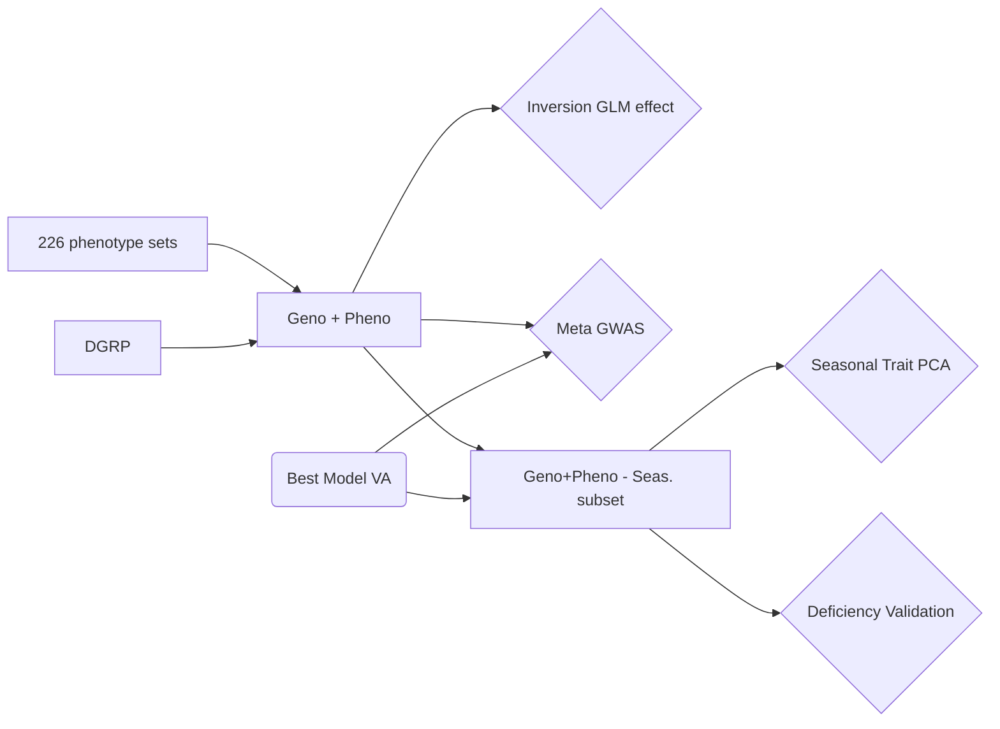

# Repo for: "A cosmopolitan inversion drives seasonal adaptation in overwintering _Drosophila_"

This is the git repo for the paper "A cosmopolitan inversion drives seasonal adaptation in overwintering Drosophila". This repo contains all the code and data needed to replicate our analyses.

# Citation
Please cite our paper as TBD

## Analysis scheme flowchart
In our paper we conduct a series of analyses to show that the cosmopolitan inversion In(2L)t is a hot-spot of seasonal adaptation in temperate Drosophila. Our analyses use four general data types: 
1. First, pooled-seq data of seasonal flies collections. These data are a combination of new data generated for this paper as well as data from [DEST](https://dest.bio/). Code across multiple folders.
2. Second, individual whole genome data  from flies in Virginia. These data are also combines with other whole genome datasets of Drosophila, including the [DGRP2](http://dgrp2.gnets.ncsu.edu/), [DPGP3](https://www.johnpool.net/genomes.html), and others (see below). Code across multiple folders.
3. Third, we used published phenotype and GWAS data done on the [DGRP2](http://dgrp2.gnets.ncsu.edu/). All the code is contained in the folder named "Code 13." 
4. Complete gene sequences for the gene [_Msp300_](https://flybase.org/reports/FBgn0261836) in _Drosophila melanogaster_, _D. simulans_, _D. yakuba_, _D. sechelia_ and _D. mauritana_. This was a small scale analysis done one specific gene so an analysis pipeline is not shown and all the code is contained in the folder named "Code 14." 

Given the diversity of these data types we show the analyses workflows below and the corresponding script sets needed to reproduce the major analyses. In these charts, squares represent data, diamonds analyses, and ovals represent final products.

### Pooled data
The main goal of the pooled data analysis is to combine seasonal genetic panels from DEST with new data generated in this study to create a joint pooled-dataset. These data set was filtered to remove samples with high D. simulans contamination as well as for samples with low temporal replication (see paper). The code to do this merger can be found in [DEST](https://dest.bio/), particularly in the mapping pipeline [git](https://github.com/DEST-bio/DEST_freeze1/tree/main/mappingPipeline). **NOTICE:** to _generate_ the `gds` object (which contains the pool-seq data) needed to run most analysis you will have to re-run the mapping pipeline in DEST. **Alternatively**, you may download a version of our working `gds` from Zenodo (doi: 10.5281/zenodo.7268191). Whether or not you want to re-generate or download depends on whether or not you would like to add additional data to the object.

The joint dataset is then used in two major analysis pipelines called "Overwintering" and "GLM". Overwintering consists in a series of multivariate analyses as well as Fst test to assess bottlenecks resulting from boom-and-bust demography and their signal in our data. These data are further filtered according to the effective coverage of the pools.  These results are then used as the basis of a simulation using [SLIM](https://messerlab.org/slim/). The GLM pipeline, on the other hand, uses all the seasonal pooled data to fit model of allele frequency change as a function of weather data obtained from the [NASA POWER](https://power.larc.nasa.gov/) dataset. In this analyses, no effective coverage filter is used because effective coverage is used as a weighting parameter in the models. These models are fit for the Virginia data as well as for other population clusters in DEST. The output of these models are the candidate SNPs for seasonality.

### Individual data
The individual whole genome data is used in order to further examining patters of molecular evolution at regions of interest identified as part of the pooled analysis, particularly the GLM pipeline. This analysis also has two main branching pipelines. A "joint analysis" route and a "VA-LD" route. The joint analysis is done by combining multiple whole genomes built from Virginia (this study) with data from the DGRP, DPGP3, and others. These whole genomes are then filtered for the regions discovered in the GLM analysis and used to estimate all sort of haplotype level statistics. The VA-LD route seeks to determine SNPs in strong linkage with the inversion to create both "In(2L)t markers" as well as "seasonal haplotype markers" (i.e., anchor SNPs). These inversion markers are created by first scanning the LD landscape of In(2L)t in the DGRP . With these patterns of variation we then train a support vector machine algorithm. This algorithm was subsequently used to predict the inversion status of all of our wild-caught data. 

The second set of markers, the  "anchor SNPs" was designed to study the patterns of allele frequency change at regions in the inversion enriched for seasonal "candidate loci". These SNPs were determined based on having high levels of LD among each other. 

### Phenotype analysis: all in Code 13
In our third analysis set, we sought to determine associations between phenotypes measured for GDRP lines and inversion status. This analysis is done at two levels. First, we looked at the general association between phenotypic values and inversion status. Second, we incorporated data from our seasonal pool-seq GLM to find windows across in(2L)t enriched for both seasonal SNPs as well as phenotypes. These information then inform downstream analyses. For example, in this paper, we chose one trait (Startle Response) to validate using deficiency mapping (i.e., hemizygocity test). 

# Files

There are multiple files needed to reproduce our analysis. These files are all publicly available and can be downloaded from the following sites.

|Dataset                |Website                          |Format/File                         |
|----------------|-------------------------------|-----------------------------|
|DEST|https://dest.bio/       |Pool-seq/SRAs          |
| DPGP3| https://www.johnpool.net/genomes.html| SEQs
| DGRP2| http://dgrp2.gnets.ncsu.edu/| VCF
|VA Pool-seq/Inds reads         |NCBI PRJNA882135         |SRAs         
|Pool-Seq Object          |doi: 10.5281/zenodo.7268191|GDS in Zenodo |  
|VA individuals processed          |doi: 10.5281/zenodo.7262567|VCF in Zenodo (phased)|
| Joint Ind-seqs | doi: 10.5281/zenodo.7262567| VCF in Zenodo
|Best GLM model Virginia           |TBD|R Object + SNP Table|
| Phenotype Tables | TBD| R Object + Table

1. **DEST:** see [https://dest.bio/](https://dest.bio/)
2. **DPGP3**: see [https://www.johnpool.net/genomes.html](https://www.johnpool.net/genomes.html)
3. **DGRP2**: see [http://dgrp2.gnets.ncsu.edu/](http://dgrp2.gnets.ncsu.edu/)
4. **VA Pools/Inds reads:** The SRA entries for the raw data from this study in NCBI.
5. **Joint Pools GDS**: Pool-seq object 
6. **VA individuals processed:** This file contains the VCF file with SNPs from the Virginia individuals. These data were filtered with shapeit and whatshap. file was compressed with  `bgzip`. You probably want to index it with `tabix` prior to use. The name of the file in Zenodo is _CM_pops.AllChrs.Whatshap.shapeit.annot.wSNPids.vcf_. Metadata for this file can be found in **Table S1**.
7. **Joint Ind-seqs:** This file contains the VCF file with SNPs from individuals from a diverser set of populations obtained from the Global Diversity Lines (Grenier et al; G3 5, 593–603; 2015) as well as from Behrman et al. (Proc. R. Soc. B Biol. Sci. 285, 20172599; 2018). This file was compressed with  `bgzip`. You probably want to index it with `tabix` prior to use. The name of the file in Zenodo is _Dmel_inds_Taylor.wSNPids.vcf.gz._ Metadata for this file can be found in **Table SXXXXXXXX** <-- fix
8. **Best GLM model Virginia:** This is an R object which contains SNP level information for the seasonal analysis of our pooled-seq data in Virginia.  **HEADERS** 
9. **Phenotype Tables:**  **TBD**  <-- fix

# Replication folders
In addition to the general code for all analysis pipelines, we also provide special code designed to reproduce all the figures from scratch. These are self-contained in R objects and can be run upon downloading this git, assuming the end user has the appropriate R libraries installed. 

# Tables and Figures
We provide files for our figures and tables in their final form. These come from both the main text as well as supplementary. 

# Contact information
Questions? -- please contact the corresponding authors [Alan O. Bergland](https://www.bergland-lab.org/) (email aob2x@virginia.edu) and [Joaquin C. B. Nunez](www.jcbnunez.org) (email jcbn@virginia.edu).

