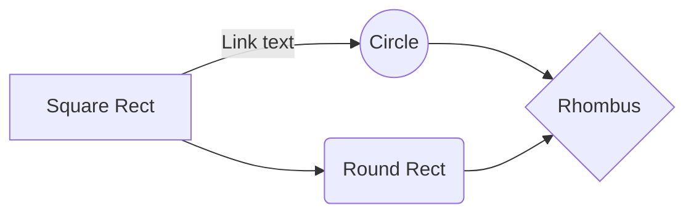

# A cosmopolitan inversion drives seasonal adaptation in overwintering Drosophila

This is the git repo for the paper "A cosmopolitan inversion drives seasonal adaptation in overwintering Drosophila". This repo contains all the code and data needed to replicate our analyses.

# Citation
Please cite our paper as TBD

# Files

There are multiple files needed to reproduce our analysis. These files can be  

