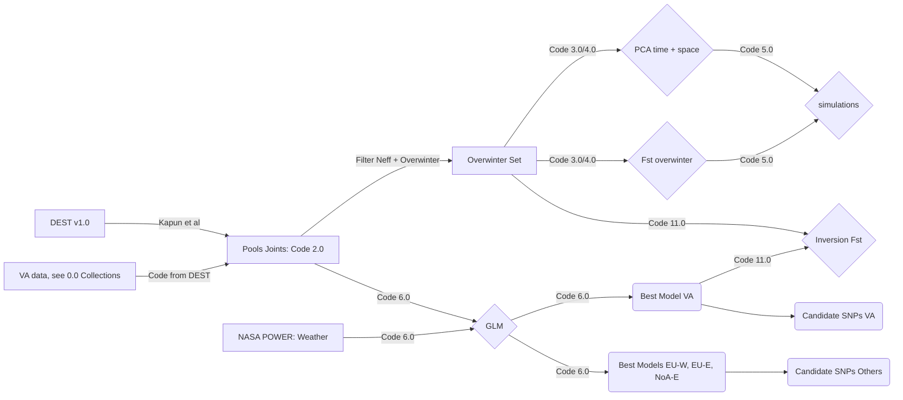
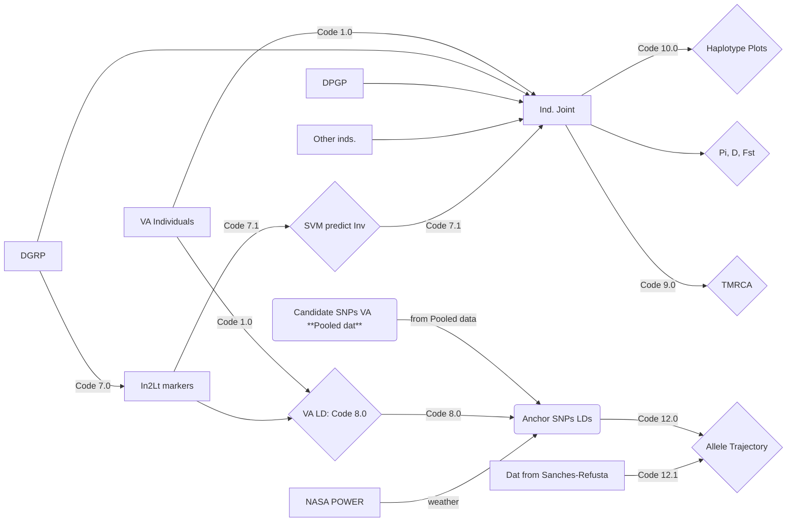
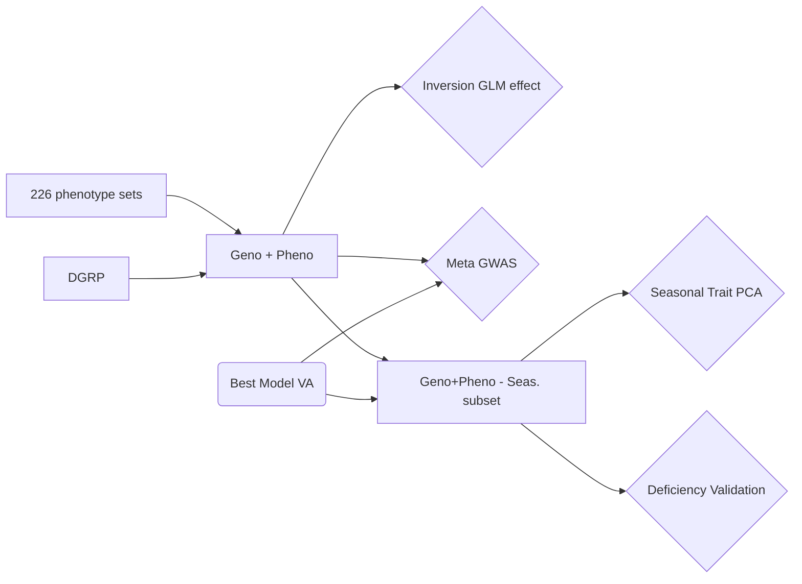

# Repo for: "A cosmopolitan inversion drives seasonal adaptation in overwintering _Drosophila_"

This is the git repo for the paper "A cosmopolitan inversion drives seasonal adaptation in overwintering Drosophila". This repo contains all the code and data needed to replicate our analyses.

# Citation
Please cite our paper as TBD

## Analysis scheme flowchart
In our paper we conduct a series of analyses to show that the cosmopolitan inversion In(2L)t is a hot-spot of seasonal adaptation in temperate Drosophila. Our analyses use four general data types: 
1. First, pooled-seq data of seasonal flies collections. These data are a combination of new data generated for this paper as well as data from [DEST](https://dest.bio/). 
2. Second, individual whole genome data  from flies in Virginia. These data are also combines with other whole genome datasets of Drosophila, including the [DGRP2](http://dgrp2.gnets.ncsu.edu/), [DPGP3](https://www.johnpool.net/genomes.html), and others (see below). 
3. Third, we used published phenotype and GWAS data done on the [DGRP2](http://dgrp2.gnets.ncsu.edu/).
4. Complete gene sequences for the gene [_Msp300_](https://flybase.org/reports/FBgn0261836) in _Drosophila melanogaster_, _D. simulans_, _D. yakuba_, _D. sechelia_ and _D. mauritana_ 

Given the diversity of these data types we show the analyses workflows below and the corresponding script sets needed to reproduce the analyses. In these charts, squares represent data, diamonds analyses, and ovals represent final products.

### Pooled data
The main goal of the pooled data analysis is to combine seasonal genetic panels from DEST with new data generated in this study to create a joint pooled-dataset. These data set was filtered to remove samples with high D. simulans contamination as well as for samples with low temporal replication (see paper). The code to do this merger can be found in [DEST](https://dest.bio/), particularly in the mapping pipeline [git](https://github.com/DEST-bio/DEST_freeze1/tree/main/mappingPipeline).

The joint dataset is then used in two major analysis pipelines called "Overwintering" and "GLM". Overwintering consists in a series of multivariate analyses as well as Fst test to assess bottlenecks resulting from boom-and-bust demography and their signal in our data. These data are further filtered according to the effective coverage of the pools.  These results are then used as the basis of a simulation using [SLIM](https://messerlab.org/slim/). The GLM pipeline, on the other hand, uses all the seasonal pooled data to fit model of allele frequency change as a function of weather data obtained from the [NASA POWER](https://power.larc.nasa.gov/) dataset. In this analyses, no effective coverage filter is used because effective coverage is used as a weighting parameter in the models. These models are fit for the Virginia data as well as for other population clusters in DEST. The output of these models are the candidate SNPs for seasonality.



### Individual data

### Phenotype analysis: all in Code 13


### MSP300 Case Study:  all in Code 14
```mermaid

```

# Files

There are multiple files needed to reproduce our analysis. These files are all publicly available and can be downloaded from the following sites.
